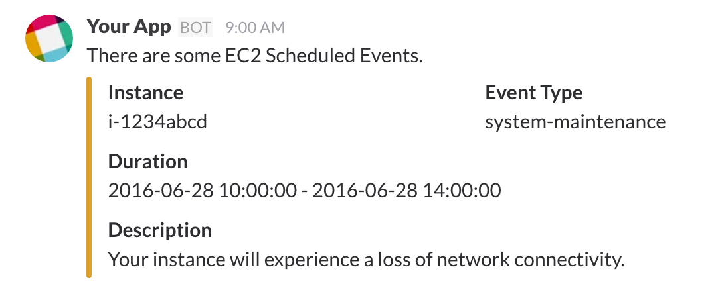

# EC2 Event Slack Notifier

AWS Lambda function to notify [EC2 Scheduled Events](http://docs.aws.amazon.com/AWSEC2/latest/UserGuide/monitoring-instances-status-check_sched.html) to Slack



## Development

At first, set AWS credentials as environment variables:

```bash
# Set AWS credentials
$ export AWS_ACCESS_KEY_ID=awsaccesskeyid
$ export AWS_SECRET_ACCESS_KEY=awssecretaccesskey
$ export AWS_REGION=ap-northeast-1 # or your region
```

Install dependencies:

```bash
$ npm install
```

Set secret variables:

```bash
$ cat src/env.js.sample
export const locale = 'ja-JP';
export const timezone = "Asia/Tokyo";
export const webHookURL = '';

$ cp src/env.js.sample src/env.js
$ vim src/env.js
```

Start development:

```bash
# Start real-time transpilation
$ npm run watch

# Execute Lambda function on local machine
$ npm run local
```

Create deployment package:

```bash
# Create .zip package
$ npm run build
$ ls dist
ec2-event-slack-notifier.zip # Upload this fils
```

## Author

Daisuke Fujita (@dtan4)

## License

[](LICENSE)
